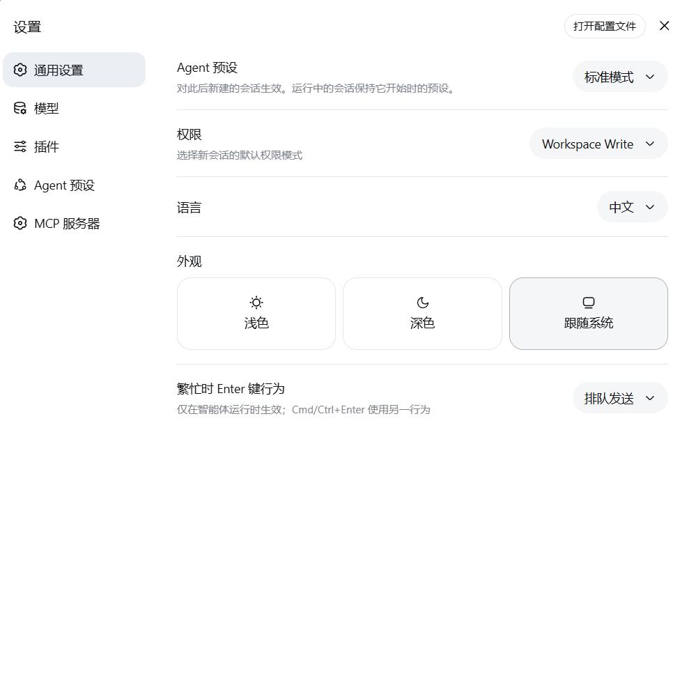
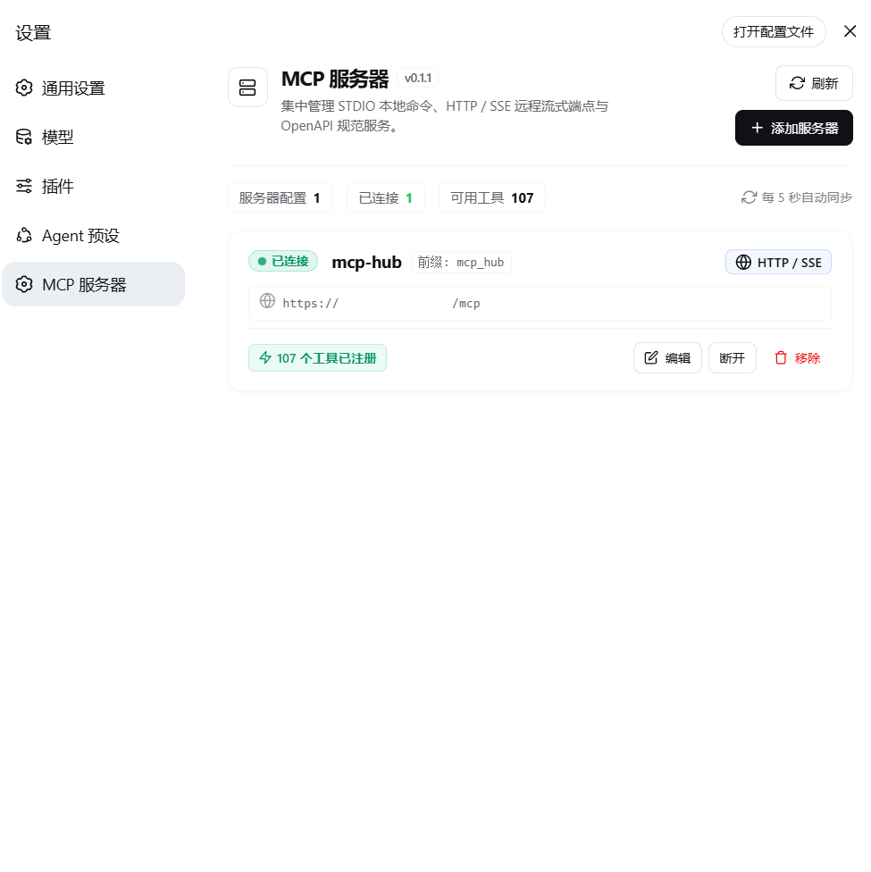
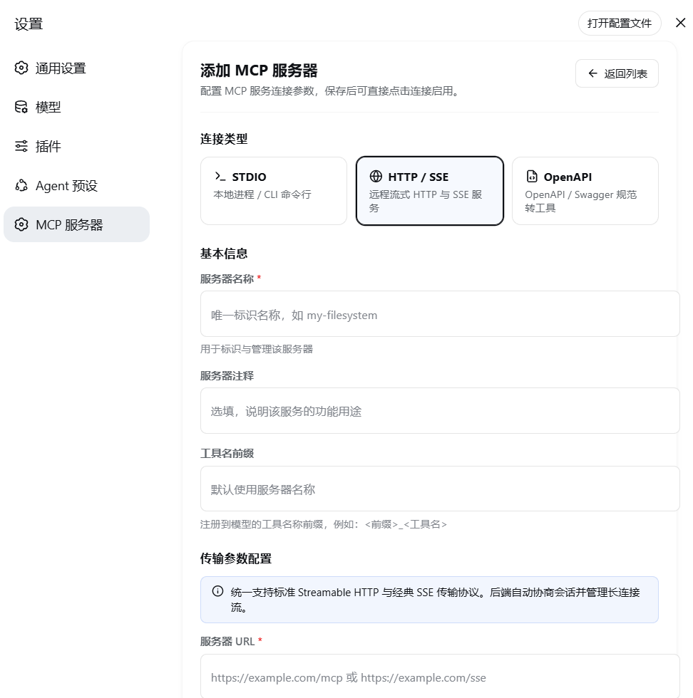

# dsh-mcp-manager

DeepSeek Harness (DSH) 的 MCP 服务器管理插件。支持 **STDIO** 本地进程、**HTTP / SSE** 统一远程流式传输，以及将 **OpenAPI** 规范转换为模型工具。连接后，服务器工具会自动同步并注册为模型可调用的工具；设置页提供现代化的可视化管理面板。







## 功能特性

- **三种核心接入方式**
  - `stdio`：派生本地进程（`npx` / `node` / `python` / `uvx` 等），使用 JSON-RPC 2.0 over NDJSON。
  - `http`：统一支持 **Streamable HTTP** 与经典 **SSE** 传输。
    - Streamable HTTP：POST 请求、`Mcp-Session-Id` 会话头、JSON / SSE 响应、`202 + Location` 轮询。
    - 经典 SSE：GET `/sse` 建立长连接流，通过 `endpoint` 事件定位 POST 端点。
    - 内置自动回退协商、断线自动重连、心跳健康检查。
  - `openapi`：从规范 URL、本地文件或 JSON 模式文本加载 OpenAPI（JSON 与常见 YAML 子集），将 `paths` 自动转换为模型工具。
- **OpenAPI 增强支持**：`$ref` 解析、安全类型（Bearer / Basic / API Key）、Cookie 会话自动携带。
- **现代化可视化管理面板**：设置 →「MCP 服务器」，支持深浅色主题、指标卡片、状态呼吸徽章、配置预览、工具数量标签、空状态指引。
- **工具自动同步**：`tools/list` → 自动注册 `<前缀>_<工具名>`；收到 `notifications/tools/list_changed` 自动刷新。
- **可靠性保证**：请求取消（`notifications/cancelled`）、HTTP / SSE 每 30s 心跳、超时与错误分级。
- **双模管理**：既可通过自然语言管理工具（`mcp_add` / `mcp_list` / `mcp_connect` / `mcp_disconnect` / `mcp_refresh` / `mcp_remove`），也可通过设置页可视化面板。
- **配置持久化**：MCP 服务器配置保存到 DSH 的本地 storage，重启 `dsh web` 后自动恢复（连接状态与已注册工具需重新建立）。

## 安装与使用

### 方式 A：从 GitHub 安装

无需本地克隆，直接在 DSH profile 中安装：

```powershell
dsh plugin --profile web add github:dong152389/dsh-mcp-manager
```

说明：

- 本插件是标准 DSH bundle 插件，包内自带 `cordis.patch.yml` 挂载声明；`dsh plugin` 会把它转发给 pnpm 安装到 `~/.dsh/profiles/web`，并通过 `dsh.bundle.patch` 自动加入 `dsh.profile.bundles` bundle 层，无需手动编辑 `cordis.patch.yml`。
- 如果设置了自定义 `DSH_HOME`，上面的命令同样适用（`dsh plugin` 会定位到 `$DSH_HOME/profiles/<name>`）。
- 若遇到 pnpm 阻止 git 依赖构建脚本（allowBuilds 报错），把 pnpm 提示的 allow 配置写入 profile 的 `pnpm-workspace.yaml` 后重试。
- 安装完成后：重启 `dsh web`，再 F5 刷新浏览器。

### 方式 B：本地开发安装

在**本仓库根目录**（`package.json` 所在目录）执行：

```powershell
dsh plugin --profile web add link:.
```

> 注意：`link:.` 表示链接当前目录，仓库根目录本身就是插件包。若仓库被放到其他路径，请用绝对路径：
>
> ```powershell
> dsh plugin --profile web add link:D:\你的路径\dsh-mcp-manager
> ```

说明：

- 本地开发推荐使用 `link:` 安装，修改源码后运行 `npm run build:formal` 重新生成 `lib/index.js`，再重启 `dsh web`。
- 如果之后移动了源码目录，需要重新执行一次 `dsh plugin --profile web add link:<新路径>`；若提示已存在/冲突，可先 `dsh plugin --profile web remove dsh-mcp-manager` 再重新 add。

### 方式 C：发布到 npm 后安装

```powershell
dsh plugin --profile web add dsh-mcp-manager
```

### 验证安装

安装并重启 `dsh web` 后，可以确认插件是否进入配置树：

```powershell
dsh web --dump-config | findstr /i "mcp-manager"
```

如果能看到 `mcp-manager` 行，说明插件已挂载；接着进入「设置 → MCP 服务器」即可管理服务器。


### 可选：DSH 动态插件方式

普通用户不需要这一步。只有在不安装正式 npm 插件、需要直接调试 `impl.js` 时才使用动态插件方式。

在 DSH 会话中创建动态 Cordis 插件，`code.host` 使用以下加载器（需要先把本仓库的 `impl.js` 与 `lib/bridge.js` 放到本机固定路径，并修改加载器中的绝对路径）：

```js
return {
  inject: ['timer', 'subprocess', 'fs', 'storageDomain'],
  async apply(ctx) {
    const fs = ctx.fs;
    const target = await fs.resolve('C:\\path\\to\\impl.js', {});
    const source = await fs.readText(target);
    const init = eval('(' + source.trim().replace(/;+\s*$/, '') + ')');
    return init(ctx, harness);
  },
};
```

> 动态插件版与正式版共用同一份实现源码（`impl.js`）。正式版通过 `scripts/build-formal.mjs` 从 `impl.js` 生成 `lib/index.js`；改动 `impl.js` 后需运行 `npm run build:formal`。

## 使用示例

添加服务器后连接，服务器工具即注册为模型工具：

```
mcp_add      { name: "my-fs", transport: "stdio", command: "npx", args: ["-y", "@modelcontextprotocol/server-filesystem", "C:\\workspace"] }
mcp_add      { name: "my-remote", transport: "http", url: "https://example.com/mcp", headers: {"Authorization": "Bearer sk-..."} }
mcp_add      { name: "petstore", transport: "openapi", specUrl: "https://petstore.swagger.io/v2/swagger.json", baseUrl: "https://petstore.swagger.io/v2", securityType: "apiKey", apiKeyName: "api_key", apiKeyValue: "..." }
mcp_connect  { name: "my-remote" }   # 之后 my_remote_xxx 工具可直接调用
```

OpenAPI 服务器还支持 `specText`（JSON 模式文本）、`specFile`（本地文件）、`cookieSession`（保存 Set-Cookie 并自动携带）。

### mcp_add 主要参数

| 参数 | 适用传输 | 说明 |
| --- | --- | --- |
| `name` | 全部 | 服务器唯一名称，后续连接 / 断开 / 移除时使用 |
| `notes` | 全部 | 注释，选填 |
| `transport` | 全部 | `stdio` / `http` / `openapi`（向后兼容接受 `sse`，保存为 `http`） |
| `command` | `stdio` | 启动命令，如 `npx`、`node`、`python`、`uvx` |
| `args` | `stdio` | 命令参数列表 |
| `cwd` | `stdio` | 工作目录，默认会话工作区 |
| `env` | `stdio` / `http` | 字符串键值环境变量 |
| `url` | `http` | 服务器端点 URL（http(s)://...，自动支持 Streamable HTTP 与 SSE） |
| `headers` | 全部 | HTTP 请求头，字符串键值 |
| `token` | 全部 | Bearer 令牌，自动附加 `Authorization: Bearer <token>` |
| `specUrl` | `openapi` | OpenAPI 规范 URL（JSON 或 YAML） |
| `specText` | `openapi` | OpenAPI 规范 JSON / YAML 文本，与 `specUrl` 二选一 |
| `specFile` | `openapi` | 本地 OpenAPI 规范文件路径（相对会话工作区） |
| `baseUrl` | `openapi` | API 基础 URL，默认取规范 `servers[0].url` |
| `securityType` | `openapi` | `none` / `bearer` / `basic` / `apiKey` |
| `securityToken` | `openapi` | `securityType=bearer` 时的令牌值 |
| `basicUser` / `basicPass` | `openapi` | `securityType=basic` 时的用户名 / 密码 |
| `apiKeyName` / `apiKeyValue` | `openapi` | `securityType=apiKey` 时的请求头名 / 值 |
| `cookieSession` | `openapi` | 保存上游 `Set-Cookie` 并在后续请求自动携带 |
| `prefix` | 全部 | 注册工具名的前缀，默认取服务器名 |

### 管理工具一览

| 工具 | 说明 |
| --- | --- |
| `mcp_add` | 添加服务器（名称、注释、传输类型与对应配置） |
| `mcp_list` | 列出所有服务器及状态（状态、工具数、传输方式、错误） |
| `mcp_connect` | 连接并同步工具（已连接时刷新） |
| `mcp_disconnect` | 断开并注销工具（配置保留） |
| `mcp_refresh` | 重新拉取已连接服务器的工具列表 |
| `mcp_remove` | 移除服务器配置（先断开） |

## 目录结构

```
dsh-mcp-manager/
├── lib/
│   ├── index.js        # 正式插件 Host 面（ESM，导出 name/inject/apply）
│   ├── client.js       # 正式插件 Client 面（lazy-CJS bundle，设置页面板）
│   └── bridge.js       # Node HTTP 桥（子进程，NDJSON 协议，支持请求头/SSE 流/取消）
├── impl.js             # 动态插件版实现源码（正式版 Host 面由它生成）
├── cordis.patch.yml    # DSH bundle 挂载声明（dsh plugin 安装后自动应用）
├── scripts/
│   └── build-formal.mjs # impl.js → lib/index.js 转换脚本
└── test/
    ├── mock-server.js  # 本地 mock MCP 服务器（流式 HTTP + SSE + Set-Cookie）
    └── test-*.jsonl    # 桥接测试用例
```

## 工作原理

宿主沙箱（动态插件）没有完整的 `fetch` / `require`，因此 HTTP 传输通过一个惰性启动的 Node 子进程桥实现：

```
插件 (cordis) ──NDJSON──▶ node lib/bridge.js ──fetch──▶ MCP 服务器
    ▲                                                       │
    └────────────────────NDJSON 响应/SSE 事件────────────────┘
```

- `request` 操作：完整收集响应（状态、头、正文、SSE 标记）。
- `sse` 操作：长连接流式解析（`endpoint` / `message` 事件），支持取消。

`stdio` 传输直接通过 DSH 的 `subprocess` 服务派生 MCP 进程，NDJSON 帧与 JSON-RPC 在同一套会话逻辑中处理。

Client 面（设置页面板）通过 `TypertRemoteService`（`@deepseek-ai/dsh-typert-protocol`）暴露 `mcpManager` Remote 服务，浏览器 bundle 经 `connection.rpc.call("/api", ...)` 与 Host 通信。

## 开发与测试

```powershell
# 构建正式插件到 lib/
npm run build:formal

# 启动本地 mock MCP 服务器
npm run test:bridge
```

另开一个终端测试桥接层：

```powershell
# 在 mock 服务器运行的前提下
Get-Content test/test-http.jsonl   | node lib/bridge.js
Get-Content test/test-cookie.jsonl | node lib/bridge.js
Get-Content test/test-sse.jsonl    | node lib/bridge.js
```

## 常见问题（Troubleshooting）

| 现象 | 原因与解决 |
| --- | --- |
| `dsh web` 报 `unsupported JSON schema: parameters.type must be a value schema object` | 正式构建文件过旧。先运行 `npm run build:formal`，再重启 DSH |
| pnpm 安装 GitHub 插件时报 `allowBuilds` / build scripts blocked | 这是 pnpm 对 git 依赖的构建脚本保护。把 pnpm 提示的 allow 配置写入 profile 的 `pnpm-workspace.yaml`，再重新 `dsh plugin --profile web add github:dong152389/dsh-mcp-manager` |
| `dsh web` 报 `Cannot find package '@deepseek-ai/dsh-tools'` | 没有用 `dsh plugin --profile web add` 安装到 DSH profile；确认插件安装在 `~/.dsh/profiles/web/node_modules` 中 |
| 报 `EADDRINUSE: address already in use 127.0.0.1:3080` | 已有一个 `dsh web` 正在运行。不要重复启动；直接打开 `http://127.0.0.1:3080`。需要重启时先按 `Ctrl+C` |
| 设置里没有「MCP 服务器」页面 | 插件 Host 面已加载但 Client 面未生效：检查是否重启过 DSH；仍无效请确认包版本 ≥ 0.1.0（含 client 面） |
| 设置页存在但列表报 `transport failure for /api/mcpManager/list: HTTP 404` | 插件版本过旧（v0.1.0 的 Remote 服务用 SRC 标记注册，要求与网关共享同一份 `@deepseek-ai/dsh-typert-protocol` 模块实例，第三方安装位置无法保证）。升级到 ≥ 0.1.1：改用 `ctx.typert.register()` 严格描述符注册，与安装位置无关 |
| 终端显示 `starship: Under a 'dumb' terminal` | 这是终端提示符的显示警告，不是 MCP 或 DSH 启动失败；可以忽略 |

## License

MIT
