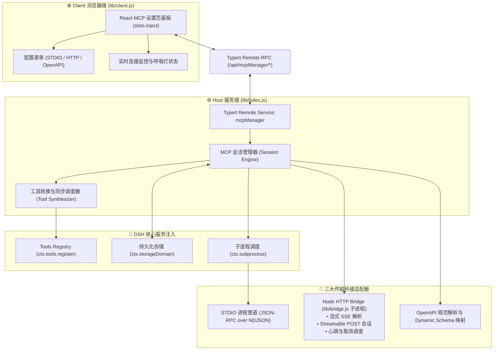

<div align="center">

# 🔌 dsh-mcp-manager

<p align="center">
  <strong>DeepSeek Harness (DSH) 可视化 MCP 服务器管理与工具同步插件</strong><br>
  <em>A modern visual dashboard & control panel for managing Model Context Protocol (MCP) servers and OpenAPI tools in DeepSeek Harness.</em>
</p>

[](package.json)
[](LICENSE)
[](https://github.com/deepseek-ai)
[](https://cordis.moe/)
[](https://modelcontextprotocol.io/)
[](#)
[](#-参与贡献与反馈)

<p align="center">
  <a href="#-为什么需要本插件">项目背景</a> •
  <a href="#-界面预览">界面预览</a> •
  <a href="#-核心特性">核心特性</a> •
  <a href="#-快速开始">快速开始</a> •
  <a href="#-配置参数与管理工具">参数参考</a> •
  <a href="#-架构与工作原理">系统架构</a> •
  <a href="#-常见问题-faq">常见问题</a> •
  <a href="#-开发与构建">开发构建</a>
</p>

---

</div>

## 💡 为什么需要本插件？

Model Context Protocol (MCP) 为大语言模型接入外部工具和知识源提供了标准化协议。然而在 DeepSeek Harness (DSH) 原生环境下，管理和调试 MCP 服务常面临以下挑战：

| 痛点场景 | 原生 DSH 现状 | 搭配 dsh-mcp-manager ✨ |
| :--- | :--- | :--- |
| **服务器接入流程** | 缺乏图形化操作入口，新增服务往往需要繁琐的代码配置或脚本接入 | **可视化一键接入**：提供开箱即用的 Web 表单，轻点几下即可完成 STDIO / HTTP / OpenAPI 服务的连接配置 |
| **多协议兼容性** | 常规集成仅支持单一命令行 `stdio` 协议，跨网络或现有 REST API 接入困难 | **全协议一体化支持**：原生支持 STDIO 本地进程、Streamable HTTP、经典 SSE 流式长连接，并可将 OpenAPI 自动转为模型工具 |
| **工具透明度与同步** | 模型当前可用哪些工具、注册是否成功处于暗箱状态，无法直观确认 | **全自动同步与前缀隔离**：连接后自动拉取并注册工具，支持独立前缀命名，动态监听 `tools/list_changed` 自动热更新 |
| **运行健康与状态监控** | 远程服务是否断线、是否存在连接错误缺乏实时感知 | **实时状态呼吸灯与指标卡片**：展示服务器总数、连接数与工具总量，内置 30 秒心跳探活与断线重连保障 |
| **双模交互与配置持久化** | 只能单向依赖人工配置或重启后丢配置 | **双模驱动 + 本地持久化**：支持设置页可视化面板操作与对话流内 Agent 工具驱动，配置由 DSH `storageDomain` 自动安全持久化 |

---

## 📸 界面预览

<div align="center">
  <table>
    <tr>
      <td align="center">
        
        <br />
        <b>⚙️ 1. 设置页菜单无缝集成</b><br />
        <sub>严格遵循 DSH 设计系统，在设置面板中新增「MCP 服务器」独立控制台</sub>
      </td>
    </tr>
    <tr>
      <td align="center">
        
        <br />
        <b>📊 2. MCP 服务器列表仪表盘</b><br />
        <sub>实时连接指标、健康呼吸状态徽章、可用工具统计与一键管理操作</sub>
      </td>
    </tr>
    <tr>
      <td align="center">
        
        <br />
        <b>➕ 3. 现代化配置表单</b><br />
        <sub>可视化切换 STDIO / HTTP·SSE / OpenAPI，配置环境变量、请求头与鉴权凭据</sub>
      </td>
    </tr>
  </table>
</div>

---

## ✨ 核心特性

### 🚀 1. 三大核心传输协议全兼容
- **STDIO（本地子进程）**：
  - 派生本地进程（如 `npx`、`node`、`python`、`uvx`、`docker` 等），基于 NDJSON 帧与 JSON-RPC 2.0 进行高速通信。
  - 支持会话级工作目录配置（`cwd`）与独立环境变量注入（`env`），原生支持请求取消广播（`notifications/cancelled`）。
- **Streamable HTTP & 经典 SSE**：
  - **统一网络流式协议**：同时支持现代 Streamable HTTP 协议（`Mcp-Session-Id` 会话跟踪、POST 通信、`202 + Location` 轮询）与经典 SSE 规范（GET `/sse` 挂载端点广播）。
  - **自动协商与恢复**：内置自动回退协商机制、网络波动断线重连以及每 30 秒一次的心跳健康检查；锁屏、休眠唤醒或上游重启后会持续以指数退避方式恢复连接。
- **OpenAPI 智能工具转换器**：
  - 直接读取 OpenAPI 3.0 / 3.1 或 Swagger 2.0 规范（支持线上 URL、本地文件或 YAML / JSON 文本）。
  - 智能解析 `$ref` 模式，将所有 `paths` 接口原子化映射并编译为严格的 DSH 对话工具。

### 🔄 2. 全生命周期工具自动同步
- **自动前缀命名空间**：服务连接后执行 `tools/list`，自动注册为 `<前缀>_<工具名>` 格式，彻底避免跨服务器的工具命名冲突。
- **动态通知监听**：自动监听服务推送的 `notifications/tools/list_changed` 事件，实时更新工具列表无须人工介入。
- **平滑注销**：主动断开或移除服务时，自动从 DSH 会话中注销已注入工具，保持对话上下文干净高效。

### 🔐 3. 完备的安全与身份认证支持
- OpenAPI 规范全面支持 **Bearer Token**、**HTTP Basic Auth** 以及 **API Key（Header）** 鉴权模式。
- 内置 **Cookie 会话保持**（`cookieSession`）：自动捕获上游接口返回的 `Set-Cookie` 并在后续链式调用中自动携带。

### 🎛️ 4. 双模管理体系（GUI + Agent Tools）
- **Web 可视化面板**：直观的深浅色卡片、实时指标计数、折叠配置预览、连接操作与空状态指引。
- **对话内 Agent 管理工具**：提供完整的内置工具集（`mcp_add` / `mcp_list` / `mcp_connect` / `mcp_disconnect` / `mcp_refresh` / `mcp_remove`），允许大模型在对话中根据意图自主管理和连接 MCP 服务。

### 🛡️ 5. 沙箱进程隔离与本地存储持久化
- **Node HTTP Bridge 隔离**：针对宿主沙箱环境缺乏独立网络和模块加载器的限制，采用轻量级 Node 子进程桥（`lib/bridge.js`）代理网络请求与流式解析，彻底隔离环境风险。
- **持久化保存**：基于 DSH 的 `storageDomain` 存储领域保存服务器配置，`dsh web` 重启后配置完整保留，开箱即用。

---

## ⚡ 快速开始

### 📋 环境要求

| 依赖项 | 建议版本 | 说明 |
| :--- | :--- | :--- |
| **Node.js** | `>= 18.0.0` | ESM 运行环境与 Child Process 支持 |
| **DeepSeek Harness (DSH)** | `>= 0.1.1-rc.2 < 0.2.0` | 具备 Cordis 4.x、Typert RPC 与 Tools 注入能力 |

通过控制台检查当前环境中的 DSH 版本：

```powershell
dsh --version
# 输出示例: 0.1.1-rc.2
```

### 🔐 权限、依赖与失败边界

本插件是一个 `R2` 高权限 DSH Web Bundle：它管理用户主动配置的 MCP 服务，并把远端或本地服务工具注册到 DSH。它不修改 DSH 核心、官方插件清单或 Profile 配置；Profile 安装、启动、卸载和回滚仍由 DSH 官方 CLI 负责。一次性 Profile 验收记录见 [`docs/dsh-profile-evidence.md`](docs/dsh-profile-evidence.md)，完整权限矩阵见 [`SECURITY.md`](SECURITY.md)。

| 能力 | 实际范围 |
| :--- | :--- |
| 文件 | 通过 DSH `fs` 读取用户指定的本地 OpenAPI 规范；通过 `storageDomain` 持久化 MCP 配置。不会写入 DSH 核心或官方 Profile 文件。 |
| 命令 | 通过 DSH `subprocess` 启动用户配置的 STDIO MCP 可执行文件，以及插件自有 Node HTTP Bridge；使用参数数组，不接受 shell 字符串。Windows 下会自动兼容 `.cmd` / `.bat` 命令包装器。用户配置的命令仍可能产生任意本地进程权限。 |
| 网络 | 可访问用户配置的 HTTP / SSE / OpenAPI URL；网络范围不是固定白名单，连接失败、超时和 SSE 断线会返回错误或触发指数退避重连。 |
| 凭据 | 支持并持久化用户主动提供的 Bearer、Basic、API Key、请求头和 Cookie；不会主动收集其他凭据或把配置发送到本项目服务。 |
| 外部依赖 | DSH 的 `subprocess`、`fs`、`tools`、`typert`、`storageDomain` 服务；Node.js；用户自行提供的 MCP 可执行文件和远端 MCP/OpenAPI 服务。 |
| 失败边界 | 无效配置、非法 Schema、进程退出、连接超时、网络断开、鉴权失败和工具注册失败都会单独报告；未连接的服务器不会注册工具，删除/断开会清理已注册工具。 |

---

### 🚀 安装方式

#### 方式 A：从 GitHub 安装（推荐日常使用）

无需手动克隆代码仓库，直接利用 DSH 插件管理器装载进 `web` profile：

```powershell
dsh plugin --profile web add github:dong152389/dsh-mcp-manager
```

> **💡 原理说明**：
> - 本插件为标准 DSH bundle 插件，自带 `cordis.patch.yml` 挂载声明。`dsh plugin` 会将其安装到 `~/.dsh/profiles/web`（若配置了 `$DSH_HOME` 则对应定位到 `$DSH_HOME/profiles/web`），并通过 `dsh.bundle.patch` 自动并入 Web profile 配置树。
> - 若遇到 pnpm 阻止 git 依赖构建脚本（`allowBuilds` 告警），请根据提示在 profile 的 `pnpm-workspace.yaml` 中为当前仓库添加许可规则后重新执行安装。

#### 方式 B：本地源码开发安装（适用于二次开发与调试）

在本地仓库根目录下完成构建并建立符号链接（`link:`）：

```powershell
# 1. 克隆代码仓库
git clone https://github.com/dong152389/dsh-mcp-manager.git
cd dsh-mcp-manager

# 2. 编译生成正式插件产物 lib/index.js
npm run build:formal

# 3. 以符号链接形式挂载到 web profile
dsh plugin --profile web add link:.
```

> **提示**：若后续需要更新挂载路径或重置配置，可先执行移除再重新添加：
> ```powershell
> dsh plugin --profile web remove dsh-mcp-manager
> dsh plugin --profile web add link:.
> ```

---

### 🔍 验证挂载与进入使用

1. **重启 DSH Web 服务**：
   在终端中重启正在运行的 `dsh web` 进程。

2. **验证配置注入**：
   通过下述命令确认 `mcp-manager` 已被配置树正常收录：
   ```powershell
   dsh web --dump-config | findstr /i "mcp-manager"
   ```

3. **进入面板**：
   在浏览器中访问 DSH 控制台（默认地址为 `http://127.0.0.1:3080`），点击左下角 **「设置」⚙️ → 「MCP 服务器」**，即可进入可视化管理面板。

---

## ⚙️ 配置参数与管理工具

### 1. `mcp_add` 核心参数参考表

通过面板新建或在对话中调用 `mcp_add` 工具时，参数规则如下：

| 参数名称 | 适用传输 | 必填 | 说明 |
| :--- | :---: | :---: | :--- |
| `name` | 全部 | **是** | 服务器唯一标识名称，后续执行连接、断开及删除时使用。 |
| `transport` | 全部 | **是** | 传输类型：`stdio` / `http` / `openapi`（输入 `sse` 会自动兼容标准化为 `http`）。 |
| `notes` | 全部 | 否 | 服务器功能与用途备注文档。 |
| `prefix` | 全部 | 否 | 注册到大模型上下文中的工具名前缀，默认取服务器名称。 |
| `headers` | `http` / `openapi` | 否 | 自定义 HTTP 请求头（键值对 JSON 对象）。 |
| `token` | `http` / `openapi` | 否 | 快捷 Bearer 鉴权凭据，自动附加 `Authorization: Bearer <token>` 请求头。 |
| `command` | `stdio` | **是** | 本地启动命令（如 `npx`、`node`、`python`、`uvx`）。 |
| `args` | `stdio` | 否 | 命令行启动参数数组（如 `["-y", "@modelcontextprotocol/server-filesystem", "/path"]`）。 |
| `cwd` | `stdio` | 否 | 进程工作目录，缺省默认为当前会话工作区。 |
| `env` | `stdio` | 否 | 环境变量字典（键值对 JSON 对象）。 |
| `url` | `http` | **是** | 远程 MCP 服务端点 URL（支持标准 HTTP POST 与 SSE 路由）。 |
| `specUrl` | `openapi` | 条件必填 | 线上 OpenAPI / Swagger 规范文档的 HTTP(S) 地址（与 `specText`/`specFile` 三选一）。 |
| `specText` | `openapi` | 条件必填 | OpenAPI 规范的完整 JSON 或 YAML 文本字符串。 |
| `specFile` | `openapi` | 条件必填 | 本地 OpenAPI 规范文件的相对路径或绝对路径。 |
| `baseUrl` | `openapi` | 否 | API 调用基地址，缺省时默认读取规范中声明的 `servers[0].url`。 |
| `securityType` | `openapi` | 否 | 接口鉴权类型：`none` / `bearer` / `basic` / `apiKey`。 |
| `securityToken` | `openapi` | 否 | 当 `securityType=bearer` 时的 Token 凭证。 |
| `basicUser` / `basicPass` | `openapi` | 否 | 当 `securityType=basic` 时的 HTTP 基本认证用户名与密码。 |
| `apiKeyName` / `apiKeyValue` | `openapi` | 否 | 当 `securityType=apiKey` 时的 Header 请求头名称及对应秘钥值。 |
| `cookieSession` | `openapi` | 否 | 布尔值，设为 `true` 时自动跟踪响应中的 `Set-Cookie` 并随后续请求持续携带。 |

### 2. 对话内 Agent 管理工具一览

除 Web 界面外，大模型可直接自主调用以下工具完成 MCP 生命周期管理：

| 管理工具 | 功能描述 |
| :--- | :--- |
| `mcp_add` | 添加新的 MCP / OpenAPI 服务器配置。 |
| `mcp_list` | 列出全部服务器的配置、传输类型、可用工具总数及当前连接健康状态。 |
| `mcp_connect` | 发起与指定服务器的握手连接，并将其公开的工具自动同步注册至对话上下文中。 |
| `mcp_disconnect` | 主动切断连接，同时从对话模型中注销对应的前缀工具（保留原有配置）。 |
| `mcp_refresh` | 重新向已连接的服务器拉取最新工具列表并刷新注册。 |
| `mcp_remove` | 彻底移除指定的服务器配置（如果正在连接中会自动先行安全断开）。 |

---

## 🏗️ 架构与工作原理

插件基于 **Cordis** 框架的控制反转（IoC）机制与 **Typert JSON-RPC** 构建，整体架构分为 Client 前端面板与 Host 后端运行时：



### 核心实现要点

1. **严格契约注册（Strict Typert Descriptors）**：
   采用 `ctx.typert.register()` 显式注册 `mcpManager` 的全量方法描述符，突破了传统 SRC 模式要求网关与插件必须共享单例模块实例的限制，杜绝 `HTTP 404 / transport failure`。
2. **Node HTTP 桥接隔离（Bridge Subprocess）**：
   在受限宿主沙箱中，缺乏常规的 Node `fetch` 与全局模块能力。插件惰性派生 `lib/bridge.js` 进程桥，以轻量 NDJSON 帧与宿主通信，完整支持流式 SSE 事件分发与异步取消。
3. **动态 OpenAPI 模式映射**：
   OpenAPI 规范被扁平化重写为 DSH 的标准工具描述符，入参类型校验由底层的 Schema Validator 直接守护。

---

## 📁 目录结构

```text
dsh-mcp-manager/
├── cordis.patch.yml          # DSH Profile bundle 挂载清单声明
├── package.json              # 插件元数据、peerDependencies 声明及脚本
├── LICENSE                   # MIT 开源协议许可
├── img/                      # 界面与功能示意图
│   ├── 1.png                 # 设置菜单入口截图
│   ├── 2.png                 # MCP 服务器列表仪表盘截图
│   └── 3.png                 # 新增/编辑配置表单截图
├── scripts/
│   └── build-formal.mjs      # 核心构建脚本：将 impl.js 转换为正式 ESM 插件 lib/index.js
├── impl.js                   # 动态版插件核心实现源码
├── lib/
│   ├── index.js              # [构建产物] Host 端正式入口（ESM）
│   ├── client.js             # [构建产物] Client 浏览器端懒加载 UI Bundle
│   └── bridge.js             # [独立桥接] Node HTTP/SSE 流式子进程代理桥
├── SECURITY.md               # 权限矩阵、外部依赖与非目标
├── docs/
│   └── dsh-profile-evidence.md # 一次性 Profile 安装/启动/卸载证据
├── test/
│   └── contract.test.mjs      # manifest、Patch 与产物契约测试
└── README.md                 # 项目使用与技术说明文档
```

---

## 🛠️ 开发与构建

修改 `impl.js` 源码后，运行以下命令即可重新编译生成宿主端正式产物：

```powershell
# 将 impl.js 编译并生成 lib/index.js
npm run build:formal
```

构建脚本会自动执行：
1. 函数签名转换并补全 ESM 标准导出声明；
2. 注入 `lib/bridge.js` 的动态寻址路径；
3. 将 Client RPC 重构替换为面向 Typert 网关的严格 `TypertRemoteService` 描述符；
4. 修正文件系统上下文依赖与工作区根目录回退逻辑。

---

## ❓ 常见问题 FAQ

<details open>
<summary><strong>Q1: 设置页没有出现「MCP 服务器」菜单？</strong></summary>

1. 确认已成功执行 `npm run build:formal` 生成正式 `lib/` 产物；
2. 确认已使用 `dsh plugin --profile web add link:.` 将插件添加至当前 profile；
3. 检查控制台配置：`dsh web --dump-config | findstr mcp-manager`；
4. 重启 `dsh web` 并在浏览器中按 `Ctrl + F5`（macOS 为 `Cmd + Shift + R`）强制刷新前端缓存。
</details>

<details open>
<summary><strong>Q2: 面板加载报错 <code>transport failure for /api/mcpManager/list: HTTP 404</code>？</strong></summary>

这是因为旧版 Remote 注册依赖 SRC 标记，要求与网关共享同一份 `@deepseek-ai/dsh-typert-protocol` 实例。本插件在 `v0.1.1` 中已全面升级为 `ctx.typert.register()` 严格描述符注册机制。重新拉取最新代码运行 `npm run build:formal` 并重启 DSH 即可彻底解决。
</details>

<details>
<summary><strong>Q3: 提示 <code>unsupported JSON schema: parameters.type must be a value schema object</code>？</strong></summary>

说明当前使用的 `lib/index.js` 产物过旧。在项目根目录下执行 `npm run build:formal` 重新构建，随后重启 DSH 即可恢复。
</details>

<details>
<summary><strong>Q4: pnpm 安装时报 <code>allowBuilds / build scripts blocked</code> 错误？</strong></summary>

这是 pnpm 针对 Git 远程依赖执行构建脚本时的安全防范策略。将 pnpm 终端提示中给出的 `allowBuilds` 配置追加至 profile 所在目录的 `pnpm-workspace.yaml` 中，随后重新运行安装命令即可。
</details>

<details>
<summary><strong>Q5: 报 <code>Cannot find package '@deepseek-ai/dsh-tools'</code>？</strong></summary>

说明未通过标准的 `dsh plugin --profile web add` 命令进行依赖装载。请确认插件已被正确安装至 `~/.dsh/profiles/web/node_modules` 目录下。
</details>

<details>
<summary><strong>Q6: 启动时提示 <code>EADDRINUSE: address already in use 127.0.0.1:3080</code>？</strong></summary>

说明后台已有正在运行的 `dsh web` 实例占用了 3080 端口。无需重复启动，直接在浏览器中访问 `http://127.0.0.1:3080` 即可；如需重启，请先在原终端中按 `Ctrl + C` 退出后再启动。
</details>

<details>
<summary><strong>Q7: 终端显示 <code>starship: Under a 'dumb' terminal</code> 告警？</strong></summary>

这是部分终端命令行美化提示符（如 Starship）在无交互环境下的提示性信息，并非 MCP 或 DSH 的运行故障，不会影响插件功能，可放心忽略。
</details>

---

## 🤝 参与贡献与反馈

非常欢迎提交 Issue 汇报缺陷或提出新功能构想，也欢迎发起 Pull Request！

1. Fork 本仓库并创建分支（`git checkout -b feature/awesome-mcp-feature`）；
2. 提交清晰的代码变更（`git commit -m 'feat: support new mcp transport'`）；
3. 推送至个人分支（`git push origin feature/awesome-mcp-feature`）；
4. 发起 Pull Request 申请合并。

---

## 📄 License

本项目基于 [MIT License](LICENSE) 协议开源。

